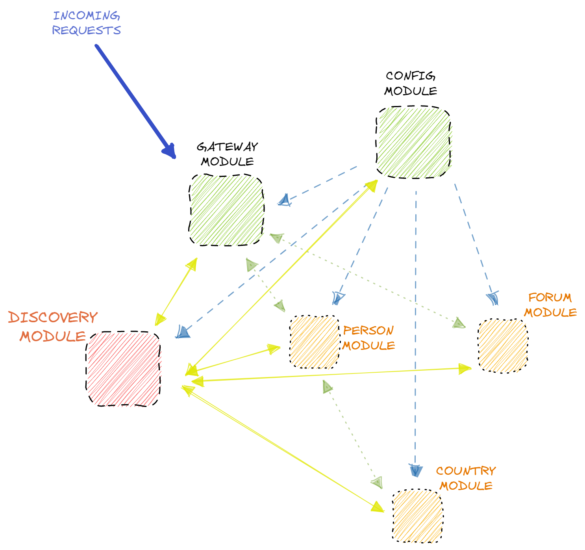

## A simple demo project on base the Spring Cloud library

**The project consist of 3 root modules:**
1. Discovery module on base Eureka
2. Config module
3. Gateway module

**and consists of 3 apps:**
1. Forum data app
2. Person data app
3. Country data app

### Install instructions

1. Go to the root folder
2. Open a terminal and run *docker-compose up*

To send requests use the templates in the rq.http file